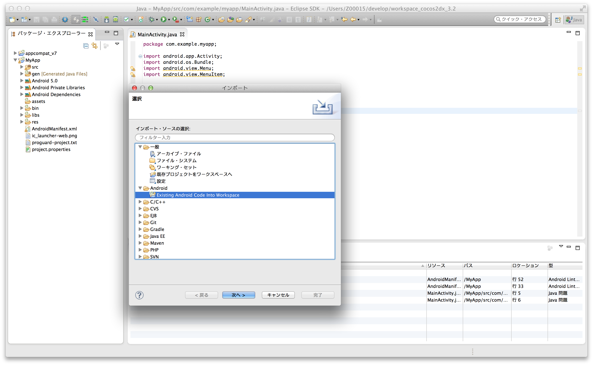

## 在Eclipse項目裡導入Google Play Services

從Eclipse菜單的「File」-> 「Import」裡選擇「Android」->「Existing Android Code into Workspace」。

導入<android-sdk>/extras/google/google_play_services/libproject/google-play-services_lib/裡的Google Play Services的類庫項目。

右鍵點擊APP的項目，選擇「Property」。從左菜單選擇「Android」。點擊右側Library的「追加」按鈕，設定從APP能夠訪問到剛才導入的Google Play Services的類庫項目。

---
[返回](../README.md)
