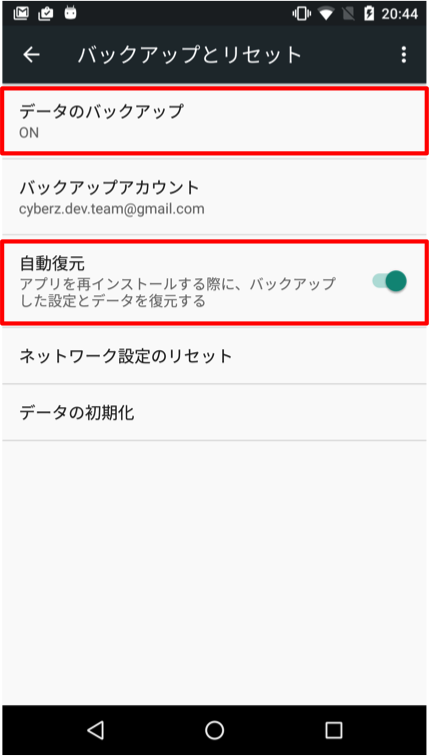

# The improvement of deduplication function using auto backup function

It is able to improve deduplication to install event by using auto backup function which is added from Android M(6.0).
If you don't need this function, you can omit the implementation of this item.

## Requirement

* It is the case of restoration of backup data from Android M terminal to more above than Android M terminal.
* It is necessary to have the same Google account when backup and restoration.
* When migrating data, like following pictures, it is required that setting of terminal is available by users.



## Configuration

When using, it is necessary to set according to the condition of application's backup setting file.

> [Configuration Reference](https://developer.android.com/training/backup/autosyncapi.html)

**[The case of backing up data of a specific application]**

Please set so that following file can be included to be subject to backup.

```
<include domain="file" path="__ADMAGE_RANDOM_DEVICE_ID__" />
```

**[The case of conducting back up data of all application]**

In the case of setting that data of application is subject to backup, please set that following files are excluded.

```
<exclude domain="file" path="__ADMAGE_WEB_CONVERSION_COMPLETED__" />
<exclude domain="file" path="__ADMAGE_APP_CONVERSION_COMPLETED__" />
```

---
[TOP](/lang/en/README.md)
