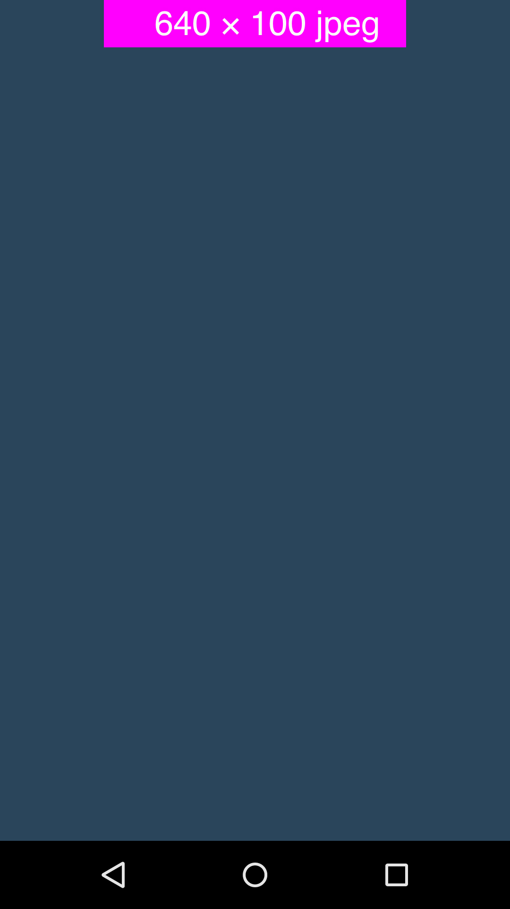

# 広告配信機能

## 1. 環境設定

組み込み対象のアプリにはGooglePlayServicesをご導入の上、AdvertisingIDを取得出来ることが必須となっております。<br>
AdvertisingIDを取得するには[`こちら`](/lang/ja/doc/google_play_services/README.md)をご確認ください。

## 1.1 AndroidManifest.xmlの設定

**[Activityの追加]**

インタースティシャル広告を表示する際に必須となるActivityとなります。<br>
以下、そのままコピーして&lt;application&gt;タグ内にご設定ください。

```xml
<activity
    android:name="co.cyberz.dahlia.DahliaActivity"
    android:theme="@android:style/Theme.Translucent" />
```

## 2. API

### BannerView

|返り値型|メソッド|詳細|
|---:|:---|:---|
|-|BannerView ( Context c )|コンストラクター|
|void|show ( String placementId )<br><br>`placementID` : 広告表示ID (管理者より発行されます)|バナー広告を表示します。|
|void|show ( String placementId, DahliaAdViewListener listener )<br><br>`placementID` : 広告表示ID (管理者より発行されます)<br>`listener` : 広告表示の際のイベントを取得するためのリスナー|バナー広告を表示します。|

### Interstitial

|返り値型|メソッド|詳細|
|---:|:---|:---|
|-|Interstitial ( Context c )|コンストラクター|
|void|show ( String placementId )<br><br>`placementID` : 広告表示ID (管理者より発行されます)|インタースティシャル広告を表示します。|
|void|show ( String placementId, DalInterStitialListener listener )<br><br>`placementID` : 広告表示ID (管理者より発行されます)<br>`listener` : 広告表示の際のイベントを取得するためのリスナー|インタースティシャル広告を表示します。|

### BannerView.OnStateListener

|返り値型|メソッド|詳細|
|---:|:---|:---|
|void|onSuccess ( View v )<br><br>`v` : 広告のView|バナー広告の表示が正常だった場合に呼ばれます。|
|void|onFailed ( View v ) <br><br> `v` : 広告のView|バナー広告が表示できなかった場合に呼ばれます。|

### Interstitial.OnStateListener

|返り値型|メソッド|詳細|
|---:|:---|:---|
|void|onSuccess ( )|インタースティシャル広告の表示が正常だった場合に呼ばれます。|
|void|onFailed ( )|インタースティシャル広告が表示できなかった場合に呼ばれます。|
|void|onClosed ( )|インタースティシャル広告が閉じられた際にに呼ばれます。|

> インタースティシャル広告が表示できなかった場合、`onFailed`メソッドが呼ばれた後にも`onClosed`メソッドは呼ばれます。

## 3. コードへの組み込み

### バナー広告表示サンプル その１

javaコードのみでの実装

```java
@Override
protected void onCreate(Bundle savedInstanceState) {
   super.onCreate(savedInstanceState);
   setContentView(R.layout.test_activity);

   // 既存レイアウトに追加
   LinearLayout ll = (LinearLayout) findViewById(R.id.banner_layout);
   // バナー広告表示View
   BannerView mBannerView = new BannerView(this);
   mBannerView.show("広告表示ID", new BannerView.OnStateListener() {
      @Override
      public void onSuccess(View v) {
        // バナー広告が正常に表示された場合の処理
        Toast.makeText(this, "成功", Toast.LENGTH_SHORT).show();
      }

      @Override
      public void onFailed(View v) {
        // バナー広告の表示に失敗した場合の処理
        Toast.makeText(this, "失敗", Toast.LENGTH_SHORT).show();
        v.setVisibility(View.GONE);
      }
   });
   ll.addView(mBannerView);
}
```

### バナー広告表示サンプル その２

layoutのXMLで定義しての実装

[xml]
```xml
<?xml version="1.0" encoding="utf-8"?>
<LinearLayout xmlns:android="http://schemas.android.com/apk/res/android"
    android:layout_width="match_parent"
    android:layout_height="match_parent"
    android:orientation="vertical">

    <co.cyberz.dahlia.BannerView
        android:id="@+id/banner"
        android:layout_gravity="center_horizontal"
        android:layout_width="wrap_content"
        android:layout_height="wrap_content" />

</LinearLayout>  
```
> `BannerView`は管理画面に登録したクリエイティブのサイズに自動調整します。横幅と縦幅の指定には`wrap_content`を指定ください。

[java]
```java
@Override
protected void onCreate(Bundle savedInstanceState) {
   super.onCreate(savedInstanceState);
   setContentView(R.layout.test_activity);

   // xmlからBannerViewオブジェクトの呼び出し
   BannerView mBannerView = (BannerView) findViewById(R.id.banner);
   // バナー広告表示View
   mBannerView.show("広告表示ID");
}
```

### インタースティシャル広告表示サンプル その１

```java
@Override
protected void onCreate(Bundle savedInstanceState) {
    super.onCreate(savedInstanceState);
    setContentView(R.layout.test_activity);
    // インタースティシャル表示用メソッド
    Interstitial mInterstitial = new Interstitial(this);
    mInterstitial.show("広告表示ID");
}
```

### インタースティシャル広告表示サンプル その２

```java
protected void onCreate(Bundle savedInstanceState) {
    super.onCreate(savedInstanceState);
    setContentView(R.layout.test_activity);
    // インタースティシャル表示用メソッド
    Interstitial mInterstitial = new Interstitial(this);
    mInterstitial.show("広告表示ID", new Interstitial.OnStateListener {
      @Override
      public void onSuccess() {
        // インタースティシャル広告が正常に表示された場合の処理
        Toast.makeText(this, "成功", Toast.LENGTH_SHORT).show();
      }

      @Override
      public void onFailed() {
        // インタースティシャル広告の表示に失敗した場合の処理
        Toast.makeText(this, "失敗", Toast.LENGTH_SHORT).show();
      }

      @Override
      public void onClosed() {
        // インタースティシャル広告を閉じられた場合の処理

      }
    });
}
```

> 使用例 : 画面A→画面Bへ遷移する際、インタースティシャル広告を表示してから遷移させるなど<br>
（画面A→インタースティシャル広告→画面B）<br>その場合、画面Aにて上記実装を行い、`onSuccess`,`onFailed`,`onCloseView`の各々のメソッド内に画面Bへの遷移する処理を実装することで可能となります。

## 4. 表示サンプル

### バナー広告サンプル

<table>
<tr>
<td align="center" style="border-style:none;">[バナー広告サンプル]</td>
<td align="center" style="border-style:none;">[インタースティシャル広告サンプル]</td>
</tr>
<tr>
<td style="border-style:none;"></td>
<td style="border-style:none;"></td>
</tr>
</table>

---
[トップ](/lang/ja/README.md)
