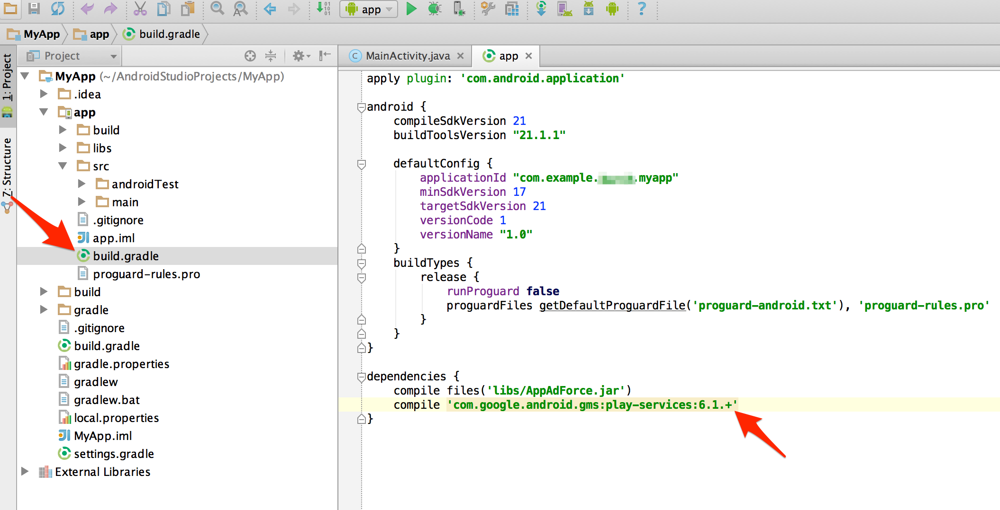

## Android StudioプロジェクトへのGoogle Play Servicesの導入

アプリケーションのモジュールディレクトリにあるbuild.gradleを開き、下記のように、最新のGoogle Play servicesへのdependenciesの設定を追記します。

```
dependencies {
	compile 'com.google.android.gms:play-services:6.1.+'
}
```

> Google Play servicesの最新のバージョンはAndroidのデベロッパーサイトにて確認するようにしてください。

[Google Play Services | Android Developers](https://developer.android.com/google/play-services/index.html)




---
[戻る](../README.md)
[トップ](/lang/ja/README.md)
