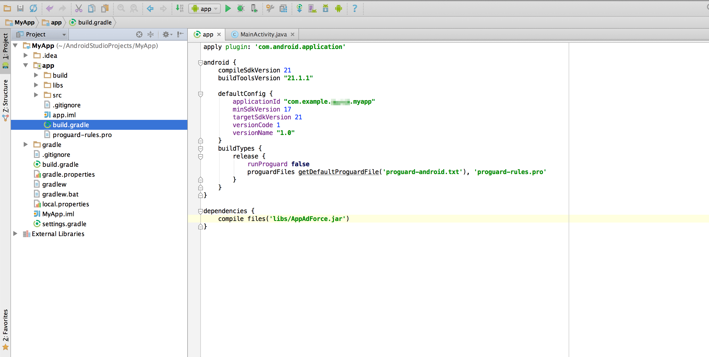

### Android Studio 프로젝트에 설치하는 방법

#### ・Gradle를 사용하여 설치할 경우

build.gradle에 하기의 설정을 적절한 장소에 추가해 주십시오.

```
repositories {
    maven {
        url "https://github.com/cyber-z/public-fox-android-sdk/raw/master/mavenRepo"
    }
}

dependencies {
    compile 'co.jp.cyberz.fox:sdk-android:v2.15.7g'
}
```

#### ・직접 설치할 경우

Android Studio 프로젝트에 AppAdForce.jar을 추가하는 방법은 아래와 같습니다.

* 앱 프로젝트의 「libs」 폴더 안에 AppAdForce.jar을 넣어 둡니다.


앱의 모듈 디렉토리에 있는 build.gradle를 열고, AppAdForce.jar의 패스를 추가합니다.

```
dependencies {
	compile files('libs/AppAdForce.jar')
}
```



---
[Top으로](/lang/ko/README.md)
