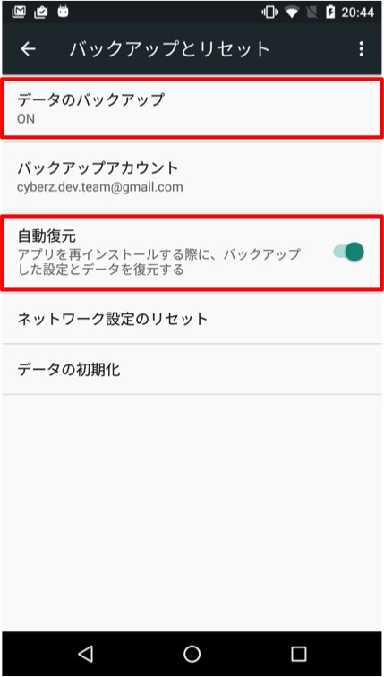

[TOP](../../README.md)　>　使用自动备份功能优化排除重复

---

# 使用自动备份功能优化排除重复

Android M(6.0)追加的自动备份功能可以提高排除重复的效果。本功能为自定义选项。

## 适用条件

* 仅限从Android M终端向Android M版本以上的终端恢复备份数据。
* 备份时和恢复时，终端登录的Google账号必须为同一个。
* 继承数据必须遵照下图，用户必须在终端操作设置为有效。



## 设置

　使用本功能时，必须根据APP的备份设置文件情况来进行设置。

> [设置参考](https://developer.android.com/training/backup/autosyncapi.html)

**[单独备份指定APP数据的情况]**

  请将以下文件设置包含在备份对象中。

```
<include domain="file" path="__ADMAGE_RANDOM_DEVICE_ID__" />
```

**[备份所有APP数据的情况]**

  设置备份所有APP数据时，请设置成排除以下文件。

```
<exclude domain="file" path="__ADMAGE_WEB_CONVERSION_COMPLETED__" />
<exclude domain="file" path="__ADMAGE_APP_CONVERSION_COMPLETED__" />
```

## 设置不去自动保存F.O.X的设定值

**[设置不去自动保存F.O.X的设定值]**

在线下模式等环境，F.O.X的设定值は被保存在Shared Preferences的co.cyberz.fox.xml文件里。在APP重新安装的时候如果不希望去继承这些设定值的话，可以参照下面来设置不去自动保存。

[Back Up User Data with Auto Backup](https://developer.android.com/guide/topics/data/autobackup.html#IncludingFiles)

**[実装例]**

manifest.xml
```
<application ...
    android:fullBackupContent="@xml/my_backup_rules"
</app>
```

my_backup_rules.xml
```
<?xml version="1.0" encoding="utf-8"?>
<full-backup-content>
    <exclude domain="sharedpref" path="co.cyberz.fox.xml"/>
</full-backup-content>

```

---
[Top](../../README.md)
