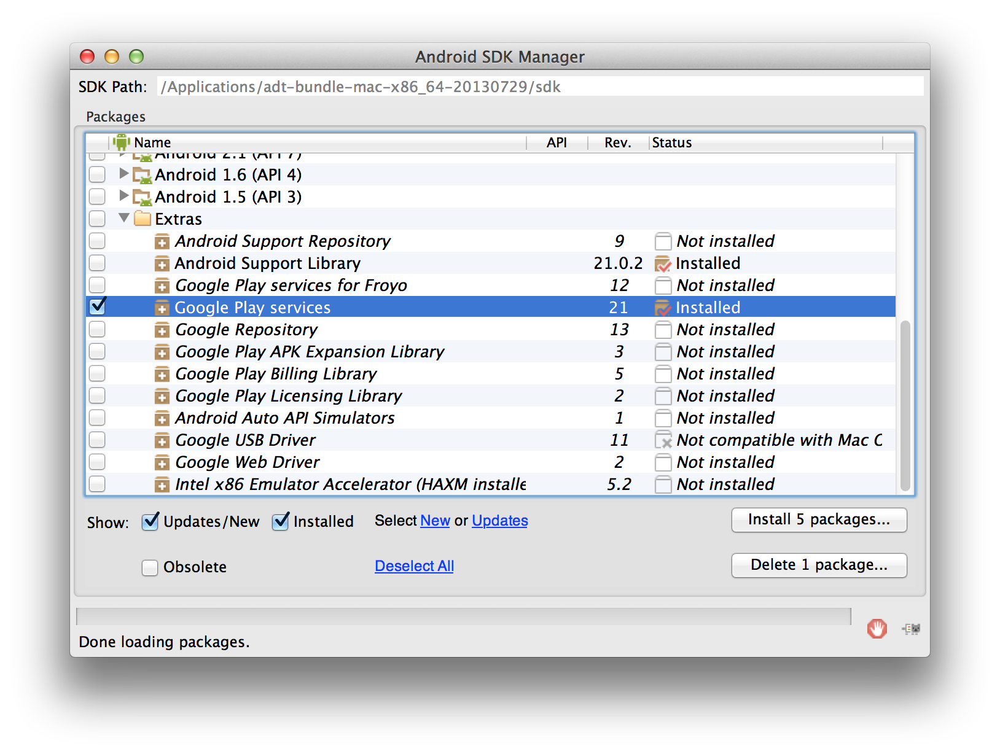

[TOP](../../README.md)　>　导入Google Play Services

---

# 导入Google Play Services

## Google Play development program准则

Force Operation X Android SDK以Google Play development program 条约为准则。该SDK为了遵守条约，已经获取永久设备ID（IMEI、MAC adress以及AndroidID）的情况下将不会获取广告ID。2014年8月1日开始，Google Play Store上所有的更新以及发布新app时，以广告为目的的终端ID必须使用广告ID。为了遵守该条约，请执行以下步骤。

## Google Play Services SDK

为了能够使用广告ID，必须安装Google Play Services SDK。<br/>
APP中没有安装Google Play Services SDK的情况时，请按照以下网页的步骤进行导入安装。

[Setting Up Google Play Services | Android Developers](https://developer.android.com/google/play-services/setup.html)

## 获取Google Play Services SDK

以下为2014年11月的Google Play Services SDK导入方法。

没有导入安装Google Play Services SDK的情况下，请从Android SDK Manager获取安装包。

* 启动Android SDK Manager。
* 勾选在Extras目录下的Google Play services，导入文件包。



## 导入Google Play Services

在项目中导入Google Play Services。 <br/>
接下来将分别说明Eclipse和Android Studio的情况，请对应使用环境参考下列导入方法。

[在Eclipse项目中导入Google Play Services](./eclipse/README.md)

[在Android Studio项目中导入Google Play Services](./android_studio/README.md)


## Google Play Services的使用设置

#### 编辑AndroidManifest.xml

使用Google Play Services前需要将下列设置写入AndroidManifest.xml的&lt;application&gt;tag中。

```xml
<meta-data
    android:name="com.google.android.gms.version"
    android:value="@integer/google_play_services_version" />
```

> ※ Android Studio导入时，不需要上面那样做版本指定。

#### 设定Proguard

使用Proguard进行代码混淆化时，请添加以下设置。

```
-keep class * extends java.util.ListResourceBundle {
    protected Object[][] getContents();
}

-keep public class com.google.android.gms.common.internal.safeparcel.SafeParcelable {
    public static final *** NULL;
}

-keepnames @com.google.android.gms.common.annotation.KeepName class *
-keepclassmembernames class * {
    @com.google.android.gms.common.annotation.KeepName *;
}

-keepnames class * implements android.os.Parcelable {
    public static final ** CREATOR;
}
```

---
[Top](../../README.md)
