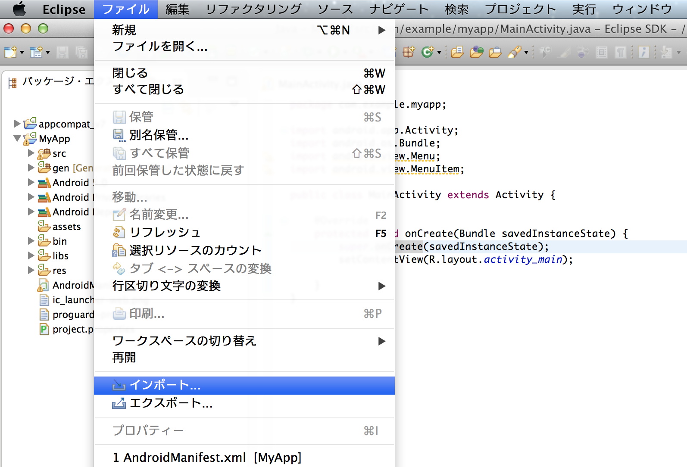
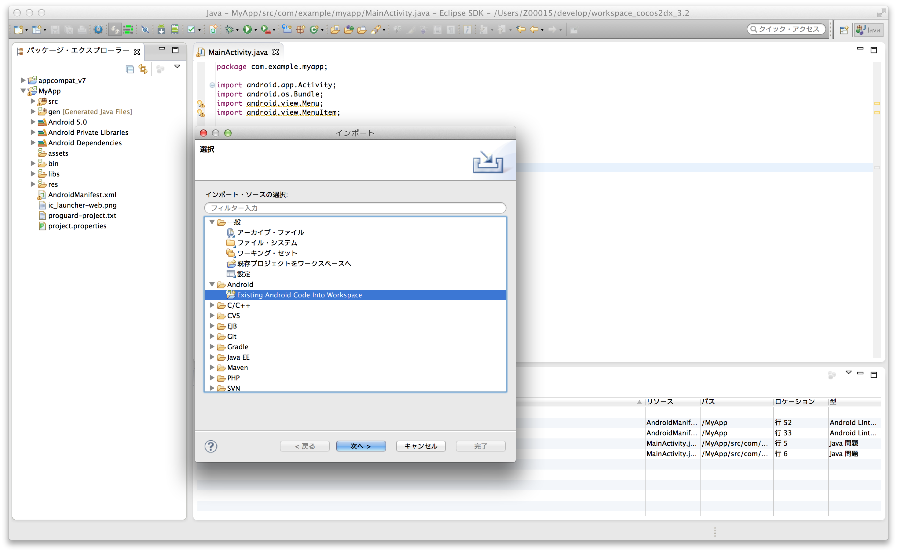
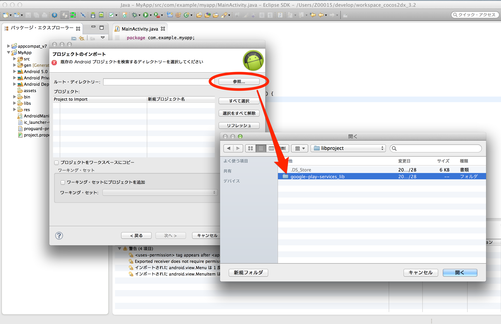
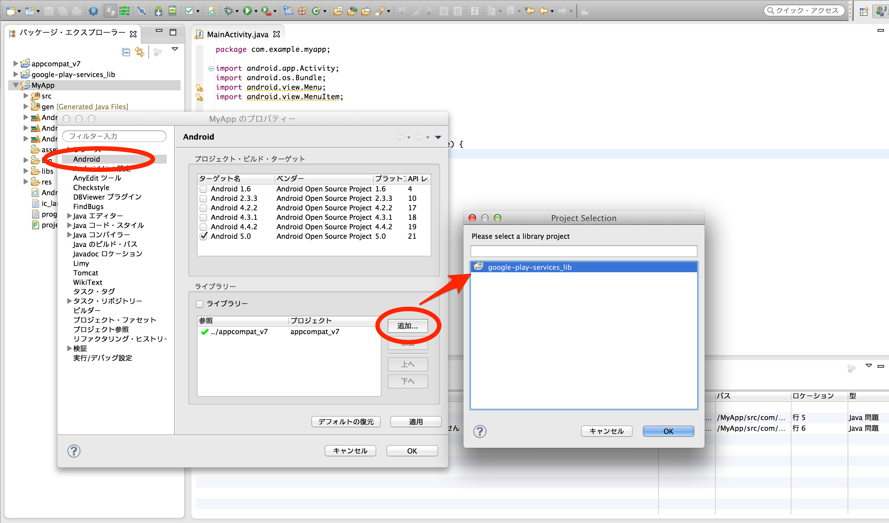

[TOP](../../README.md)　>　[导入Google Play Services](../README.md)　>　Eclipse项目

---

## 将Google Play Services导入Eclipse项目

Eclipse菜单中点击【文件】>【导入】，选择【Android】>【Existing Android Code into Workspace】

导入&lt;android-sdk&gt;/extras/google/google_play_services/libproject/google-play-services_lib/路径下的Google Play Services的类库项目。

右击APP项目，选择【属性】。在左侧菜单中选择【Android】。点击右侧library的【添加】按钮，可以在APP浏览事先导入的Google Play Services 类库项目。

---
[返回](../README.md)

[Top](../../../README.md)
