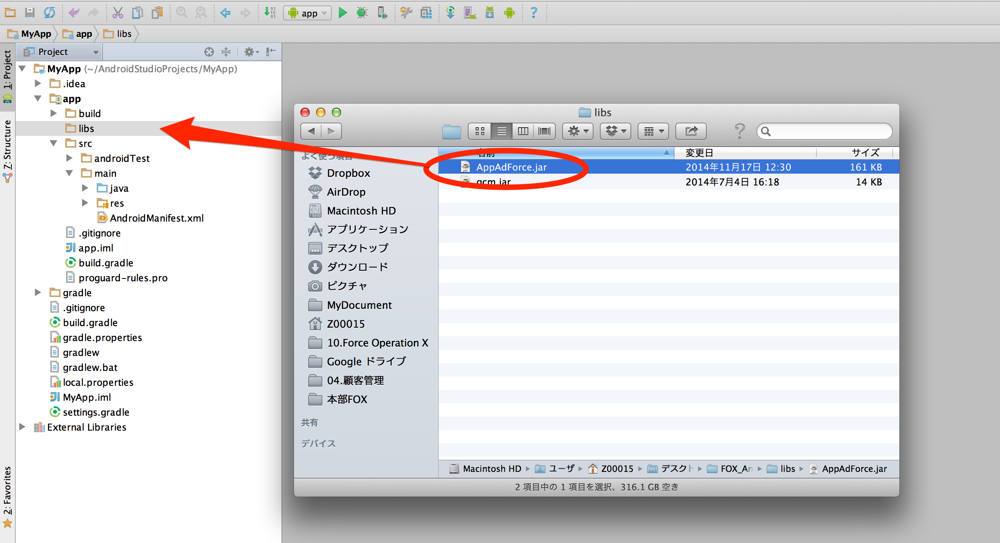
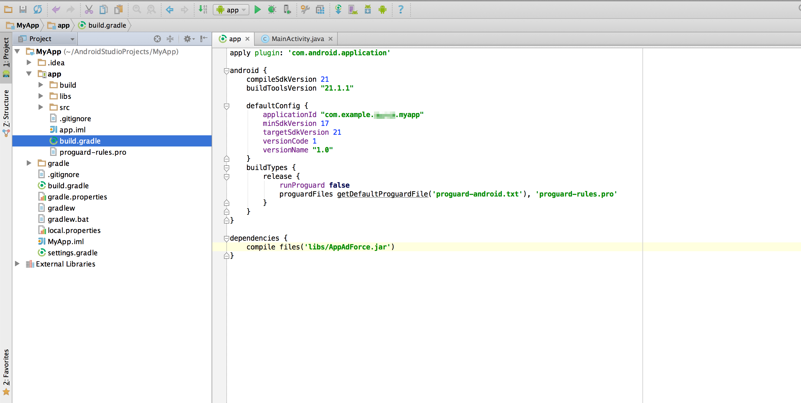

[TOP](../../../README.md)　>　导入到Android Studio项目

---

# 导入到Android Studio项目

## 利用Gradle进行导入的情况

请在build.gradle中适当位置添加下列设置。

```
repositories {
    maven {
        url "https://github.com/cyber-z/public-fox-android-sdk/raw/master/mavenRepo"
    }
}

dependencies {
    implementation 'co.cyberz.fox:track-core:{VERSION}'
}
```

## 手动导入的情况

在Android Studio项目中添加AppAdForce.jar。方法如下。

* 在APP项的中［libs］文件夹中放置AppAdForce.jar。



打开APP的Module目录中的build.gradle，添加访问foxtrack-core_{VERSION}.jar的路径。

```
dependencies {
	implementation files('libs/foxtrack-core_{VERSION}.jar')
}
```



---
[Top](../../../README.md)
