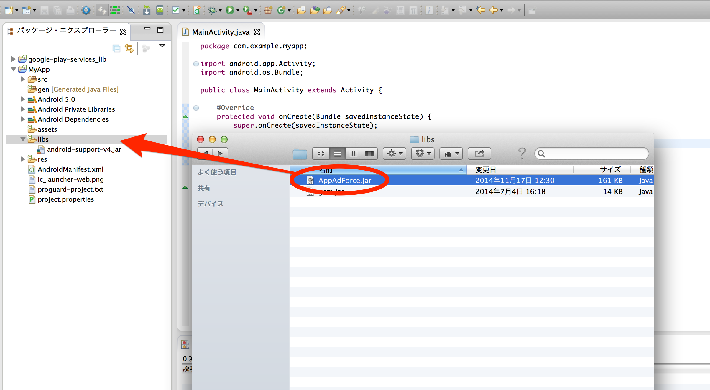
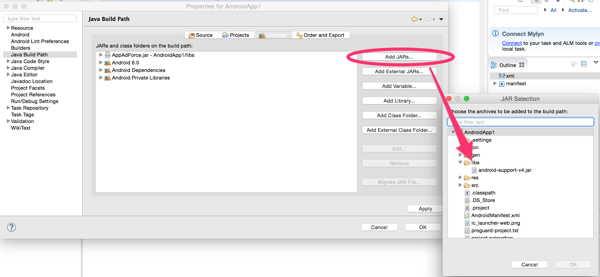

[TOP](../../../README.md)　>　导入到Eclipse项目

---

# 导入到Eclipse项目

在Eclipse项目中，将foxtrack-core_{VERSION}.jar以外部jar包的形式导入的方法如下。

* 复制foxtrack-core_{VERSION}.jar到APP项目的［libs］目录下

* 选择APP,右击选择［属性］，弹出属性窗口
* 属性窗口左侧菜单中选择［Java Build Path]
* 选中属性窗口右侧的［libraries］页，点击［添加JARs］
* 选择刚刚复制到APP的「libs」目录里的「foxtrack-core_{VERSION}.jar」

---
[Top](../../../README.md)
