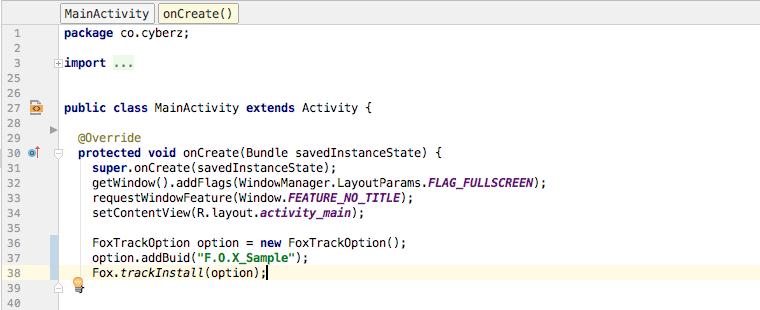

[TOP](../../README.md)　>　Install计测的详细

---

# Install计测的详细

* [1. Install计测的安装](#track_install_basic)
* [2. Install计测的安装(指定option)](#track_install_optional)
* [3. 其他的Install计测安装案例](#track_install_other)

<div id="track_install_basic"></div>

## 1. Install计测的安装

通过使用trackInstall方法可以进行Install计测。使用Cookie计测手法时会弹跳出外部浏览器，这时外部浏览器的迁移目的地可以通过在trackInstall的参数中指定URL字符串来实现。


编辑项目中的代码，针对APP启动时呼出的Activity，请按照以下内容来编码。


```java
import co.cyberz.fox.Fox;

@Override
public void onCreate(Bundle savedInstanceState) {
	Fox.trackInstall();
}
```

> ※ 未指定参数调用trackInstall方法时，将优先使用F.O.X管理页面上的设置内容。在编写代码当中指定Cookie计测手法时跳转目的地URL时，请参考本章以后的说明。

> ※ 没有特殊理由的情况下，请在启动APP时呼出Activity的onCreate方法中编码实现trackInstall方法。在其他位置编码可能会导致Install数无法正确计测。<br>
APP启动时呼出Main的Activity的onCreate方法中未编码的状态下实行Install成果型广告时，必须向广告代理店或媒体单位进行说明。未正确进行计测就开始投放Install成果型广告，可能会产生超过计测Install数的广告费用。



<div id="track_install_optional"></div>

## 2. Install计测的安装(指定option)

想要用Callback来获取Install计测完成后的信息、跳转到特定的URL、用APP动态生成URL时，请使用下面的[`FoxTrackOption`](../sdk_api/README.md#foxtrackoption)类。<br>

```java
import co.cyberz.fox.FoxTrackOption;
import co.cyberz.fox.Fox;

@Override
public void onCreate(Bundle savedInstanceState) {
  super.onCreate(savedInstanceState);

  // 初次启动的Install计测
  FoxTrackOption option = new FoxTrackOption();
  option.setRedirectUrl("myapp://top")
        .setBuid(getUserId())
        .setOptOut(true)
        .setTrackingStateListener(new FoxTrackOption.TrackingStateListener() {
           @Override
           public void onComplete() {
             showTutorialDialog();
           }
        });
  Fox.trackInstall(option);
}

@Override
protected void onResume() {
    super.onResume();
    // 请一定调用
    Fox.trackDeeplinkLaunch(this);
}
```

> ※ 上述示例代码是一个跳转目的地・BUID・有无optout・计测完成的回调函数受理的编码案例。<br>设置TrackingStateListener后完成计测处理时会调用onComplete方法，因此请在Install计测完成后马上想处理的内容请编写代码到此处。

> ※ Cookie计测有效的时候、从浏览器跳转回APP之后调用TrackingStateListener的onComplete方法。请一定在恢复回来的Activity的onResume里面执行`Fox.trackDeeplinkLaunch`方法。<br>不执行的话，不会调用onComplete方法。
```java
@Override
protected void onResume() {
    super.onResume();
    // 请一定调用
    Fox.trackDeeplinkLaunch(this);
}
```

> ※ optout为有效时，可以将用户从广告投放对象中移除。<br>
另外，optout仅在APP中已有用户可选optout功能的情况下有效。

> ※ F.O.X SDK的API式样说明请确认[这里](../sdk_api/README.md)。

<div id="track_install_other"></div>

## 3. 其他的Install计测安装案例

在Application继承类中执行`Fox.trackInstall()`，可以将启动计测方面的处理集中汇总。<br>
但由于在调用Activity前进行处理，很难使用FoxTrackOption进行指定BUID或指定Optout。因此，在Fingerprint计测和InstallReferrer计测等Cookie计测手法以外时有效。

```java
import android.app.Application;
import co.cyberz.common.FoxConfig;
import co.cyberz.fox.Fox;

public class YourApplication extends Application {

    @Override
    public void onCreate() {
        super.onCreate();

        // 激活处理
        private int FOX_APP_ID = 发行的APP ID;
        private String FOX_APP_KEY = "发行的APP KEY";
        private String FOX_APP_SALT = "发行的APP SALT";
        new FoxConfig(this, FOX_APP_ID, FOX_APP_KEY, FOX_APP_SALT).activate();

        // APP的生命周期的检查
        registerActivityLifecycleCallbacks(new ApplicationLifeCycleCallbacks());
    }


    private static final class ApplicationLifeCycleCallbacks implements ActivityLifecycleCallbacks {

	    @Override
	    public void onActivityCreated(Activity activity, Bundle savedInstanceState) {
	      // Install计测
	      Fox.trackInstall();
	    }

	    @Override
	    public void onActivityStarted(Activity activity) {
	    }

	    @Override
	    public void onActivityResumed(Activity activity) {
	      // Session tracking
	      Fox.trackSession();
	      // 流失唤回广告计测
	      Fox.trackDeeplinkLaunch(activity);
	    }

	    @Override
	    public void onActivityPaused(Activity activity) {
	    }

	    @Override
	    public void onActivityStopped(Activity activity) {
	    }

	    @Override
	    public void onActivitySaveInstanceState(Activity activity, Bundle outState) {
	    }

	    @Override
	    public void onActivityDestroyed(Activity activity) {
	    }
  }
}
```

---
[Top](../../README.md)
