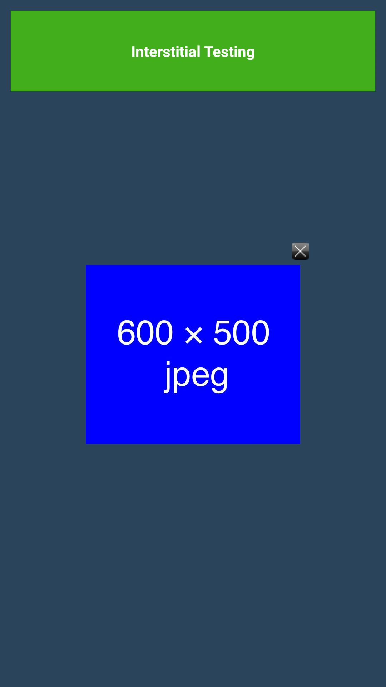

# 広告配信機能

## 1. 環境設定

對於嵌入對象APP，必須導入GooglePlayServices來取得AdvertisingID。<br>
取得AdvertisingID的方法請到[`這裏`](/lang/zh-tw/doc/google_play_services/README.md)確認。

## 1.1 AndroidManifest.xml的設定

**[Activity的添加]**

是指在顯示插播廣告的時候作為必須的Activity。<br>
請原封不動拷貝下面的代碼設定到&lt;application&gt;裡。

```xml
<activity
    android:name="co.cyberz.dahlia.DahliaActivity"
    android:theme="@android:style/Theme.Translucent" />
```

## 2. API

### BannerView

|返回值類型|方法|詳細|
|---:|:---|:---|
|-|BannerView ( Context c )|構造函數|
|void|show ( String placementId )<br><br>`placementID` : 廣告表示ID (由管理員發行)|表示橫幅廣告。|
|void|show ( String placementId, DahliaAdViewListener listener )<br><br>`placementID` : 廣告表示ID (由管理員發行)<br>`listener` : 為了取得廣告表示事件的監聽器|表示橫幅廣告。|

### Interstitial

|返回值類型|方法|詳細|
|---:|:---|:---|
|-|Interstitial ( Context c )|構造函數|
|void|show ( String placementId )<br><br>`placementID` : 廣告表示ID (由管理員發行)|表示插播廣告。|
|void|show ( String placementId, DalInterStitialListener listener )<br><br>`placementID` : 廣告表示ID (由管理員發行)<br>`listener` : 為了取得廣告表示事件的監聽器|表示橫幅廣告。|

### BannerView.OnStateListener

|返回值類型|方法|詳細|
|---:|:---|:---|
|void|onSuccess ( View v )<br><br>`v` : 廣告的View|橫幅廣告正常表示時被調用。|
|void|onFailed ( View v ) <br><br> `v` : 廣告的View|橫幅廣告不能正常表示時被調用。|

### Interstitial.OnStateListener

|返回值類型|方法|詳細|
|---:|:---|:---|
|void|onSuccess ( )|插播廣告正常表示時被調用。|
|void|onFailed ( )|插播廣告不能正常表示時被調用。|
|void|onClosed ( )|橫幅廣告關閉時被調用。|

> 插播廣告不能正常表示時，會先調用`onFailed`方法，然後調用`onClosed`方法。

## 3. 嵌入到代碼

### 3.1 橫幅廣告表示實例1

只用java代碼的安裝

```java
@Override
protected void onCreate(Bundle savedInstanceState) {
   super.onCreate(savedInstanceState);
   setContentView(R.layout.test_activity);

   // 添加到既存佈局裡
   LinearLayout ll = (LinearLayout) findViewById(R.id.banner_layout);
   // 橫幅廣告表示View
   BannerView mBannerView = new BannerView(this);
   mBannerView.show("広告表示ID", new BannerView.OnStateListener() {
      @Override
      public void onSuccess(View v) {
        // 橫幅廣告表示正常時的處理
        Toast.makeText(this, "成功", Toast.LENGTH_SHORT).show();
      }

      @Override
      public void onFailed(View v) {
        // 橫幅廣告表示失敗時的處理
        Toast.makeText(this, "失敗", Toast.LENGTH_SHORT).show();
        v.setVisibility(View.GONE);
      }
   });
   ll.addView(mBannerView);
}
```

### 3.2 橫幅廣告表示實例2

使用layout的XML定義的安裝

[xml]
```xml
<?xml version="1.0" encoding="utf-8"?>
<LinearLayout xmlns:android="http://schemas.android.com/apk/res/android"
    android:layout_width="match_parent"
    android:layout_height="match_parent"
    android:orientation="vertical">

    <co.cyberz.dahlia.BannerView
        android:id="@+id/banner"
        android:layout_gravity="center_horizontal"
        android:layout_width="wrap_content"
        android:layout_height="wrap_content" />

</LinearLayout>  
```
> `BannerView`會按登錄到管理畫面的廣告圖的尺寸來自動調整。橫幅和縱幅的指定請使用`wrap_content`。

[java]
```java
@Override
protected void onCreate(Bundle savedInstanceState) {
   super.onCreate(savedInstanceState);
   setContentView(R.layout.test_activity);

   // 從xml調用BannerView對象
   BannerView mBannerView = (BannerView) findViewById(R.id.banner);
   // 橫幅廣告表示View
   mBannerView.show("広告表示ID");
}
```

### 3.3 插播廣告表示實例1

```java
@Override
protected void onCreate(Bundle savedInstanceState) {
    super.onCreate(savedInstanceState);
    setContentView(R.layout.test_activity);
    // 表示插播廣告用的方法
    Interstitial mInterstitial = new Interstitial(this);
    mInterstitial.show("廣告表示ID");
}
```

### 3.4 插播廣告表示實例2

```java
protected void onCreate(Bundle savedInstanceState) {
    super.onCreate(savedInstanceState);
    setContentView(R.layout.test_activity);
    // 表示插播廣告的方法
    Interstitial mInterstitial = new Interstitial(this);
    mInterstitial.show("広告表示ID", new Interstitial.OnStateListener {
      @Override
      public void onSuccess() {
        // 插播廣告正常表示時的處理
        Toast.makeText(this, "成功", Toast.LENGTH_SHORT).show();
      }

      @Override
      public void onFailed() {
        // 插播廣告表示失敗時的處理
        Toast.makeText(this, "失敗", Toast.LENGTH_SHORT).show();
      }

      @Override
      public void onClosed() {
        // 插播廣告關閉時的處理

      }
    });
}
```

> 使用實例：從畫面A跳轉到畫面B的時候，表示完插播廣告以後讓其跳轉<br>
（畫面A→插播廣告→畫面B）<br>這時，在畫面A裡進行如上的安裝，能夠在`onSuccess`,`onFailed`,`onClose`的各個方法裡安裝跳轉到畫面B的處理。

## 4. 表示實例

<table>
<tr>
<td align="center" style="border-style:none;">[橫幅廣告實例]</td>
<td align="center" style="border-style:none;">[插播廣告實例]</td>
</tr>
<tr>
<td style="border-style:none;"></td>
<td style="border-style:none;"></td>
</tr>
</table>

---
[Top](/lang/zh-tw/README.md)
