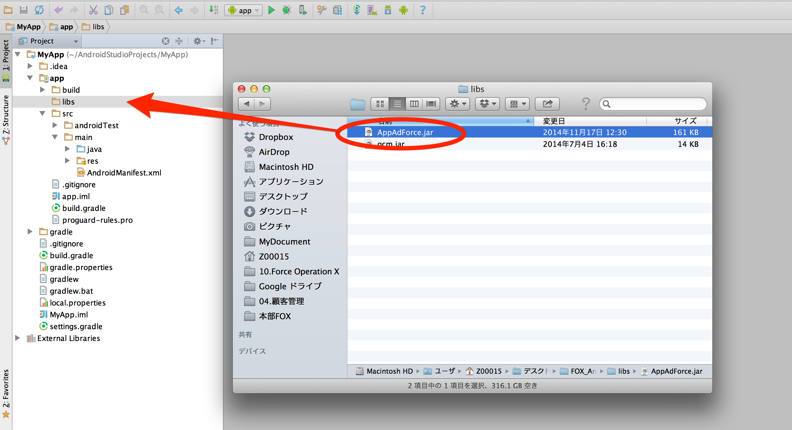

### AndroidStudio項目的導入方法

#### ・使用Gradle來導入

請把下面的設定追加到恰當的地方。

```
repositories {
    maven {
        url "https://github.com/cyber-z/public-fox-android-sdk/raw/master/mavenRepo"
    }
}

dependencies {
    compile 'co.jp.cyberz.fox:sdk-android:v2.15.7g'
}
```


#### ・手動導入

把AppAdForce.jar追加到Android Studio項目裡的方法如下。

* 拷貝AppAdForce.jar到APP項目的「libs」目錄下




打開APP的Module Directory裡的build.gradle，追加訪問AppAdForce.jar的路徑。

```
dependencies {
	compile files('libs/AppAdForce.jar')
}
```


---
[TOP](/lang/zh-tw/README.md)
